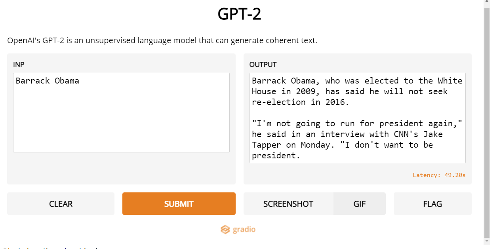

## TextGEN-GPT2-GRADIO

OpenAI's GPT-2 is an unsupervised language model that can generate coherent text.

**Generative Pre-trained Transformer 2 (GPT-2) is an open-source artificial intelligence created by OpenAI GPT-2 translates text, answers questions, summarizes passages and generates text output on a level that, while sometimes indistinguishable from that of humans, can become repetitive or nonsensical when generating long passages**. It is a general-purpose learner; it was not specifically trained to do any of these tasks, and its ability to perform them is an extension of its general ability to accurately synthesize the next item in an arbitrary sequence. GPT-2 was created as a "direct scale-up" of OpenAI's 2018 GPT model,with a ten-fold increase in both its parameter count and the size of its training dataset.

**The GPT architecture implements a deep neural network, specifically a transformer model, which uses attention in place of previous recurrence- and convolution-based architectures.** 

Attention mechanisms allow the model to selectively focus on segments of input text it predicts to be the most relevant. This model allows for greatly increased parallelization, and outperforms previous benchmarks for **RNN/CNN/LSTM-based models.**

